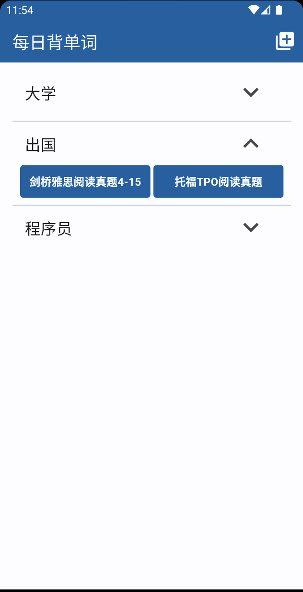
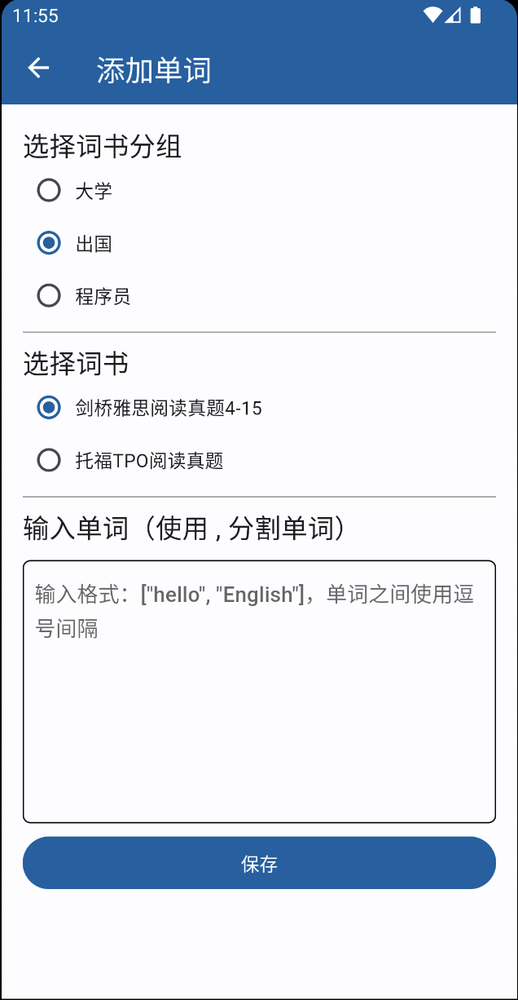
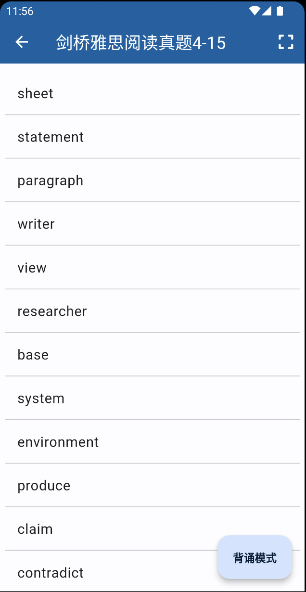
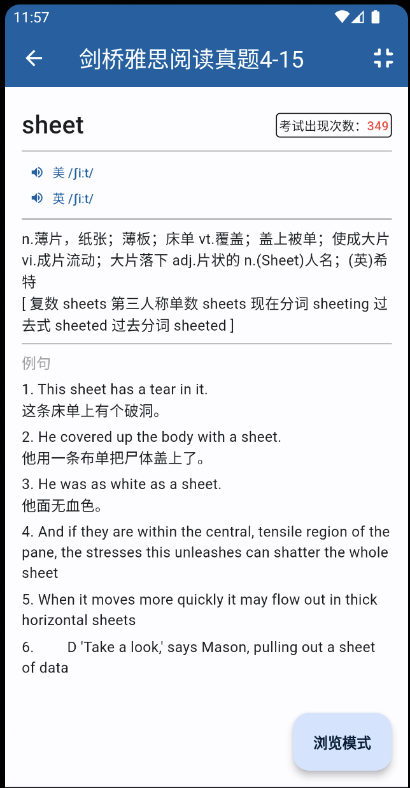

# learn_words_flutter

本项目是使用 Flutter 开发的一个背单词 App。

以词书为维度可对单词进行导入、背诵等操作；

本项目的灵感来源：[YouZack 背单词](https://bdc2.youzack.com/Recitation/Home)，部分设计及数据参考或来源于该网站，注意：本项目目前非 YouZack 背单词官方版本。

界面截图如下：

首页

添加单词

列表模式

背诵模式

## Getting Started

This project is a starting point for a Flutter application.

A few resources to get you started if this is your first Flutter project:

- [Lab: Write your first Flutter app](https://docs.flutter.dev/get-started/codelab)
- [Cookbook: Useful Flutter samples](https://docs.flutter.dev/cookbook)

For help getting started with Flutter development, view the
[online documentation](https://docs.flutter.dev/), which offers tutorials,
samples, guidance on mobile development, and a full API reference.
